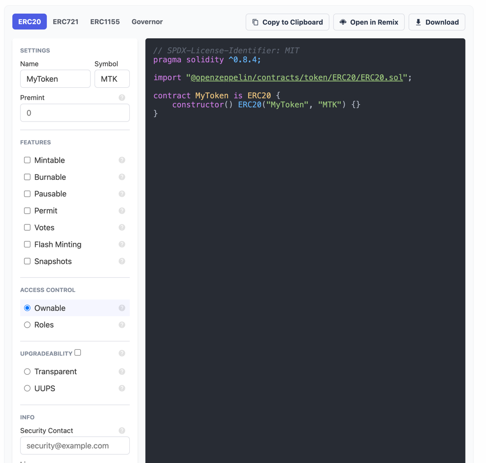

# Niftios^(name subject to change)^

## Description

Niftios is a service that allows you to 
- create nfts
- import existing nft contracts
- management (find usecase for your nfts through):
  - novel web3 native projects
  - integration with web2 services to make them work with nfts
- support infrastructure for the nft development and distribution

The goal is to make NFTs invisible to the end user and to make them accessible to the developer, while reaping the benefits of the NFTs.

Niftios builds on top of great open-source projects and so it will also be open-source project as well.

Niftios operates in 3 modes depending on the end user needs of decentralization and trustlessness.
- **Self-hosted** It will be open-source project and it uses opensource libraries which means it can be hosted by anyone.
- **Trustless / Trust-minimized mode**. Users will be interacting with the service through their web3 wallet, so they will be the owners / admins of the smartcontracts, Niftios will only provide a nice interface to ease the use of the them. 
- **Hosted mode**, each project gets a web3 wallet hosted in a secure location on the niftios backend. This mode is for projects that want to use the service as a service. It abstracts away all the smart contract interactions for the operator and optionally for the end user.

It will be possible to self-host the service on your own server and achieve full automation of the hosted-mode node. 

Support will be provided for the hosted-mode node, holders of Niftios NFT will get priority support.

## Create or Import NFTs

### Create NFT

#### Simple
- Simple one of a kind erc 721 token in a shared smart contract. (FREE)
- Simple one of a kind erc 1155 token in a shared smart contract. (FREE)

#### Regular
- Collection of erc 721 tokens
- Collection of erc 1155 tokens

In _hosted mode_, Bob will be able to create their own token and distribute it to their users. They won't need a crypto wallet to do this, their end users will be able to save the NFT to their email and claim it to their wallet once they are prepared to do so.
Bob will be able to use all the integrations provided by Niftios
In _hoste mode_ Bob is trusting the host of the niftios platform, but anytime Bob can transfer ownership to their wallet.

In trustless mode, Bob can build their own smart contract according to their needs  and deploy through the Niftios platform but using their web3 wallet as deployer and admin.
Then Bob can use the Niftios platform to get the required infrastructure (remix browser ide, blockchain indexer, ipfs file storage, analytics) to make their project great.

_Everytime new collection is deployed it is deployed through a factory contract which reduces the gas costs for Bob and Niftios platform._

### Import NFT
If Bob already has a NFT smart contract, they can import it to Niftios. Once imported they will be able to use Niftios to get analytics about the token contract. 
If Bob's connected metamask account has the right permissions on the contract (owner, admin, etc), they can use Niftios to integrate with any platform that is available on the platform. 

## Manage NFTs

### Blockchain Analytics
- Display all NFT holders (and their social media if known)
- History of transfer for each NFT or account
- Order NFT holders by their wallet value
- https://thegraph.com/ Graph protocol support out of the box
- https://dune.com/ integration

### Social analytics
- Social media sentiment analysis
- Track social media activity after campaign launch

### Integrations 
#### Web2
- https://www.prefinery.com/ (referall system)
- https://www.eventbrite.com/ (create token gated event on eventbrite, use the token as a ticket, give the token for free to the attendees)
- http://meetup.com/ (create token gated event on meetup, use the token as a ticket, give the token for free to the attendees)
- https://www.tiktok.com/en/ (login with your tiktok account and turn your video into a token, give NFT to followers)
- https://www.youtube.com/ (login with your youtube account and turn your video into a token, give NFT to subscribers)
- https://www.instagram.com/ (login with your instagram account and turn your posts into a token, give NFT to followers)
- https://wordpress.org/  (token gated posts, give NFTs to authors)
- https://mailchimp.com/ (token gated emails, give NFTs to subscribers, airdrop NFT to subscribers)
- https://stripe.com/ ( give NFTs to customers after paying)
- https://www.shopify.com/ (token gated shopify store, give NFTs to customers after paying, sell NFTs on your shopify store)
- https://www.salesforce.com/eu/ (link to your salesforce account, connect your salesforce data with onchain data)
- https://twitter.com/ (give users a NFT for tweeting specific content, give NFTs to followers)
- https://github.com/ (give rewards to contributors on github (dynamic NFT based on number of commits))

#### Web3
- Onchain commenting system using the blockchain and the NFTs to reward users for their comments or limit commenting to nft holders only. 
- Onchain voting system using the blockchain and the NFTs to reward users for their votes or limit voting to nft holders only.
- NFT puzzle game using the blockchain and the NFTs as puzzles
- NFT flipbook (collect all nfts to complete the flipbook)
- https://snapshot.org/
- https://lens.xyz/
- Support for data from web3 marketplaces (opensea etc..)

### Infrastructure support
- Private IPFS node for file storage and garantuing good performance
- Private hosted graph (https://thegraph.com/) node endpoint for retrieving onchain data
- Typescript sdk for interacting with integrations in Bob's custom project
- Blockchain bridge for bridging NFTs from one blockchain to another

## Technical details

### Stack
- Postgres database
- Supabase server for wrapping the database and giving us authentication 
- Nextjs for the frontend 
- Servless functions for wiring the integrations

### Useful tech to be used:
- https://www.onegraph.com/ (graphql api for glueing services together)
- https://thegraph.com/ for indexing onchain data
- https://dune.com/ for onchain data analysis